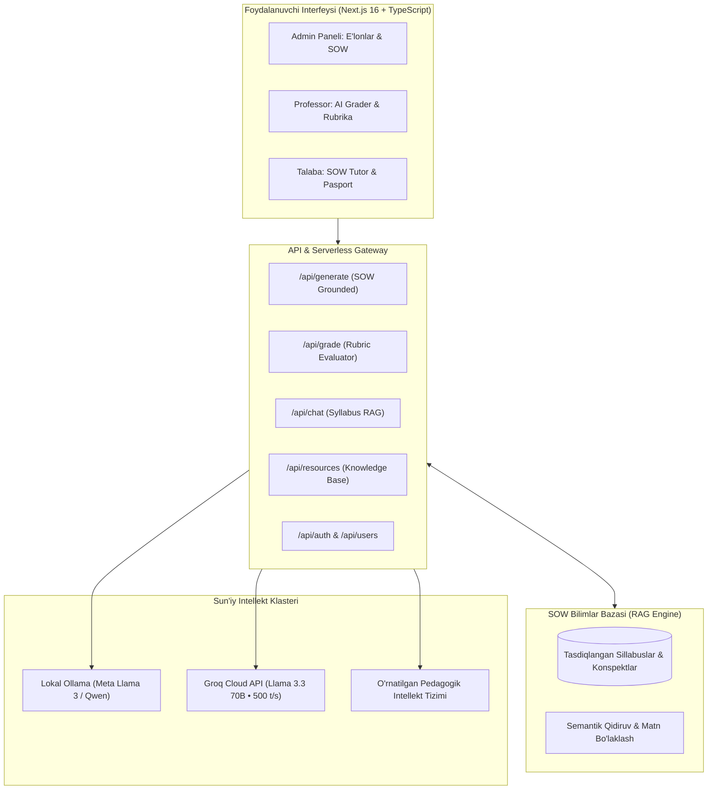

# Tafakkur AI — Universitetlar Uchun Maxfiy va Lokal Sun'iy Intellekt Platformasi

<div align="center">
  
  <h3>Umummilliy AI Xakaton — Oliy Ta'lim Yo'nalishi (2026)</h3>
  <p><b>Urganch Davlat Universiteti • Privacy-First University AI Operating System</b></p>
</div>

---

## 📌 Muammo va Yechim

### ⚠️ Mavjud Muammo
1. **Ma'lumotlar xavfsizligi va maxfiylik:** Chet el ochiq sun'iy intellekt tizimlari (ChatGPT, Claude) dan foydalanish talabalar baholari, professorlarning yopiq imtihon savollari va universitet ichki hujjatlarining tashqariga sizib chiqishiga (data leakage) olib keladi.
2. **O'qituvchilarning ortiqcha yuklamasi:** Yuzlab talabalarning dasturlash kodi va laboratoriya ishlarini tekshirish professorlarning haftasiga 15–20 soat vaqtini oladi.
3. **Sillabusdan uzilganlik:** Umumiy AI modellar universitetning Davlat Ta'lim Standarti (DTS) va rasmiy o'quv rejasiga (SOW) bo'ysunmaydi va talabalarga noto'g'ri/chalg'ituvchi ma'lumot beradi.

### 💡 Tafakkur AI Yechimi
Tafakkur AI — oliy ta'lim muassasalari uchun ishlab chiqilgan, universitetning o'z serverlarida (Ollama) yoki xavfsiz cloud Llama klasterida ishlaydigan yaxlit operatsion tizim:
- **100% Ma'lumotlar Maxfiyligi:** Barcha hisob-kitoblar va ma'lumotlar universitet yurisdiksiyasida qoladi.
- **SOW (Scheme of Work) Asosida RAG:** AI Repetitor faqat universitet ma'muriyati va kafedra tasdiqlagan rasmiy o'quv dasturi doirasida javob beradi.
- **AI Avto-Baholovchi (Grader):** Professor belgilagan rubrika mezonlari (nazariya, algoritmik murakkablik, xotira samaradorligi, kod tozaligi) bo'yicha talaba ishini sonli baholaydi va tahliliy xulosa beradi.

---

## 👥 3 Ta Asosiy Rol Imkoniyatlari

| Rol | Modul | Asosiy Vazifasi |
| :--- | :--- | :--- |
| **Admin** (Rektorat / Dekanat) | **E'lonlar Generatori & SOW Boshqaruvi** | Qisqa tezislardan rasmiy universitet buyruq va e'lonlarini yaratish; fan sillabuslari va o'quv resurslarini bilimlar bazasiga yuklash. |
| **Professor** (Katta O'qituvchi) | **AI Grader (Avto-Baholash)** | Rubrika bo'yicha talaba topshiriqlarini avtomatik tahlil qilish, 100 ballik baholash, mezonlar taqsimotini ko'rish va bahoni HEMIS tizimiga tasdiqlash. |
| **Talaba** (Bakalavr / Magistr) | **SOW AI Tutor & Akademik Pasport** | O'quv dasturi bo'yicha shaxsiy repetitor, interaktiv dasturlash mashqlari, oraliq nazorat simulyatori hamda AI Akademik Pasport. |

---

## 🏗️ Tizim Arxitekturasi



---

## 🛠️ Texnologiyalar Steki

- **Frontend:** Next.js 16.3 (App Router + Turbopack), React 19, TypeScript, Tailwind CSS 4.
- **Backend:** FastAPI (Python 3.10+), Pydantic, SQLite (Foydalanuvchilar va resurslar).
- **AI Modellar & RAG:** 
  - Mahalliy inference: **Ollama** (`llama3` / `qwen2.5-coder`).
  - Yuqori tezlikdagi Cloud LLM: **Groq** (`llama-3.3-70b-versatile` / `llama-3.1-8b-instant`).
  - SOW Semantic Retrieval: O'quv dasturi bo'yicha hujjatlarni avtomatik indekslash va ajratish.
- **Integratsiya:** O'zbekiston OTM **HEMIS REST API** mijozi (`backend/hemis_client.py`).
- **Deploy:** Vercel (Edge / Serverless Route Handlers).

---

## 🚀 Mahalliy Ishga Tushirish (Local Setup)

### 1. Mahalliy Ollama Modelini O'rnatish
```bash
# Ollama o'rnatilganidan so'ng modelni yuklab oling
ollama pull llama3

# Ollama xizmatini ishga tushiring
ollama serve
```

### 2. Python Backendni Ishga Tushirish (Ixtiyoriy)
```bash
cd backend
python -m venv venv
# Windows:
.\venv\Scripts\activate
# Linux/Mac:
source venv/bin/activate

pip install -r requirements.txt
uvicorn main:app --reload --port 8000
```

### 3. Next.js Frontendni Ishga Tushirish
```bash
cd frontend
npm install
npm run dev
```
Brauzerda oching: `http://localhost:3000`

---

## ⚙️ Muhit O'zgaruvchilari (Environment Variables)

### Frontend (`frontend/.env.local`)
| O'zgaruvchi | Tavsif | Namunaviy Qiymat |
| :--- | :--- | :--- |
| `GROQ_API_KEY` | *(Tavsiya etiladi)* Bepul Llama 3.3 70B uchun Groq kaliti | `gsk_...` |
| `OLLAMA_URL` | Mahalliy yoki tunnel orqali ulangan Ollama manzili | `http://localhost:11434` yoki `https://xyz.ngrok-free.app` |
| `NEXT_PUBLIC_API_URL` | Tashqi Python backend manzili (bo'sh qoldirilsa native Next.js API ishlaydi) | `http://localhost:8000` |

### Backend (`backend/.env`)
| O'zgaruvchi | Tavsif | Standart Qiymat |
| :--- | :--- | :--- |
| `OLLAMA_URL` | Ollama generate endpointi | `http://localhost:11434/api/generate` |
| `MODEL_NAME` | Tanlangan LLM modeli | `llama3` |
| `CORS_ORIGINS` | Ruxsat etilgan domenlar | `http://localhost:3000,https://*.vercel.app` |

---

## 📊 REAL vs MOCKED Taqqoslash Jadvali (Xakaton Halollik Standarti)

| Funksional Qism | Holati | Izoh |
| :--- | :---: | :--- |
| **Lokal & Cloud Llama 3 Infirensiyasi** | 🟢 **REAL** | Mahalliy Ollama (`localhost:11434`) yoki Groq Llama 3.3 orqali real vaqtda matn generatsiyasi. |
| **SOW Bilimlar Bazasi (RAG Grounding)** | 🟢 **REAL** | Yuklangan o'quv dasturlari va konspektlardan matnni qidirib, javobni faqat sillabusga bog'laydi. |
| **AI Rubrika Baholovchi (Grader)** | 🟢 **REAL** | Professor rubrikasi va talaba kodini tahlil qilib, 100 ballik shkala va kriteriyalar bo'yicha ball ajratadi. |
| **Next.js Serverless API Route Handlers** | 🟢 **REAL** | Barcha 11 ta API endpoint Vercel'da to'liq dinamik serverless funksiya sifatida ishlaydi. |
| **HEMIS API Integratsiyasi** | 🟡 **REAL CLIENT** | Haqiqiy `student.hemis.uz/rest/v1` REST mijozi yozilgan. API token kiritilmaganda demo namunalarni ko'rsatadi. |
| **Akademik Pasport Kripto-Xeshi** | ⚪ **MOCKED** | Blokcheyn/HEMIS simulyatsiyasi uchun deterministik xesh ko'rsatilgan. |

---

## 👨‍💻 Jamoa

- **Loyiha nomi:** Tafakkur AI
- **Universitet:** Urganch Davlat Universiteti (UrDU)
- **Yo'nalish:** Oliy ta'lim jarayonlarini sun'iy intellekt yordamida raqamlashtirish
- **Umummilliy AI Xakaton — 2026**
